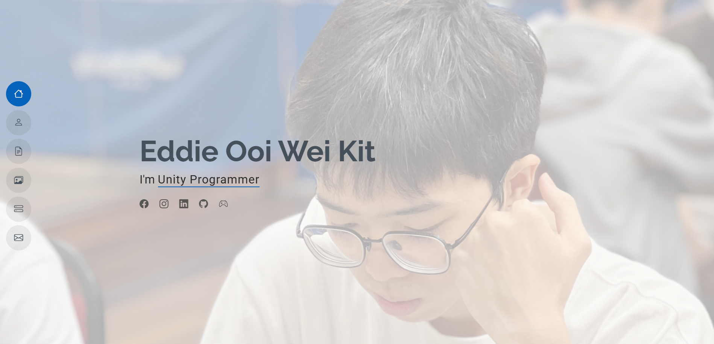

<div align="center">

# 🎮 3ddGemu Portfolio
**Interactive Personal Portfolio Showcase & Web Development Projects**

</img>
[](#)
[](#)
[](#)
[](#)

</div>

---

## 📌 About The Project

Welcome to **3ddGemu-Portfolio**! This repository houses my personal interactive web portfolio, highlighting work across **Game Development**, **Virtual Reality (VR)**, **Procedural Generation**, **Graphics Programming**, **AI Automation**, and **Human-Computer Interaction (HCI)**.

---

## 🚀 Featured Showcase Projects

| Project | Category / Domain | Tech & Features | View Details |
| :--- | :--- | :--- | :---: |
| 🎓 **FYP: Speak Up!** | Multi-Agent Gen-AI / VR | OpenAI Whisper, ChatGPT, TTS, Ready Player Me | [Explore](https://eddieooi.github.io/3ddGemu-Portfolio/portfolio-fyp.html) |
| 🥽 **Virtual Reality** | VR / Immersion | Unity 3D, C#, VR Interactions, VIRNECT | [Explore](https://eddieooi.github.io/3ddGemu-Portfolio/portfolio-virnect.html) |
| 🪵 **Delight's Despair** | Game Design / Narrative | Unity 3D, Environmental Storytelling, Gameplay Systems | [Explore](https://eddieooi.github.io/3ddGemu-Portfolio/portfolio-delight's_despair.html) |
| 🩸 **Sanguine Echoes** | Game Programming | Gameplay Mechanics, Level Design, Audio Systems | [Explore](https://eddieooi.github.io/3ddGemu-Portfolio/portfolio-sanguine_echoes.html) |
| 🏃 **Tagkour** | Movement / Physics | Parkour Mechanics, Dynamic Gameplay | [Explore](https://eddieooi.github.io/3ddGemu-Portfolio/portfolio-tagkour.html) |
| 🏞️ **Procedural Terrain** | Procedural Generation | Voronoi Diagrams, Algorithmic Generation | [Explore](https://eddieooi.github.io/3ddGemu-Portfolio/portfolio-voronoiproceduralgenterrain.html) |
| 💻 **Graphics Programming** | Shaders & Rendering | WebGL, Shader Pipelines, Custom Rendering | [Explore](https://eddieooi.github.io/3ddGemu-Portfolio/portfolio-graphicprogramming.html) |
| 🚀 **Spaceship Xtreme** | Arcade / C++ | Graphics Programming, C++, Custom Shaders | [Explore](https://eddieooi.github.io/3ddGemu-Portfolio/portfolio-spaceshipxtreme.html) |
| ⚡ **n8n Automation** | Workflow Automation | n8n, API Integrations, Webhooks, Google Flow | [Explore](https://eddieooi.github.io/3ddGemu-Portfolio/portfolio-n8n.html) |
| 📱 **Mobile App Dev** | Mobile Applications | Cross-Platform UI, Real-Time State Management | [Explore](https://eddieooi.github.io/3ddGemu-Portfolio/portfolio-mobileappdev.html) |
| 🖥️ **HCI Projects** | Interface Design | User Experience, Accessibility, Interactive Design | [Explore](https://eddieooi.github.io/3ddGemu-Portfolio/portfolio-hci.html) |
| ☕ **Java Application** | Software Development | Java, Object-Oriented Design, Desktop UI | [Explore](https://eddieooi.github.io/3ddGemu-Portfolio/portfolio-java.html) |
---

## 🛠️ Project Structure

```text
3ddGemu-Portfolio/
├── 📁 assets/                     # Stylesheets, JS scripts, and media
│   ├── 📁 css/                   # Custom & Bootstrap styles
│   ├── 📁 img/                   # Project screenshots & icons
│   └── 📁 js/                    # Interactive scripts
├── 📄 index.html                  # Portfolio Landing Page
├── 📄 portfolio-fyp.html          # Gen-AI Multi-Agent VR Showcase
├── 📄 portfolio-vr.html           # Virtual Reality Projects
├── 📄 portfolio-tagkour.html      # Tagkour Game Project
├── 📄 portfolio-adwsain.html      # Brand & Design Works
└── 📄 ......
